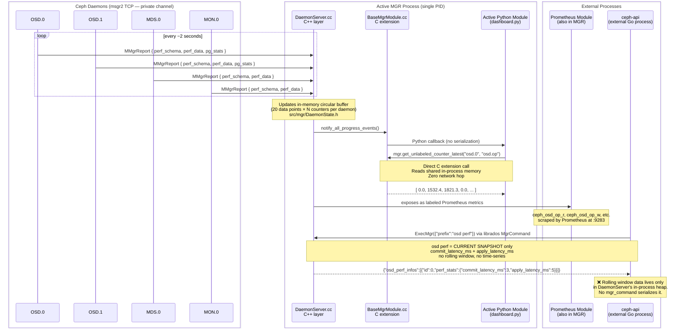
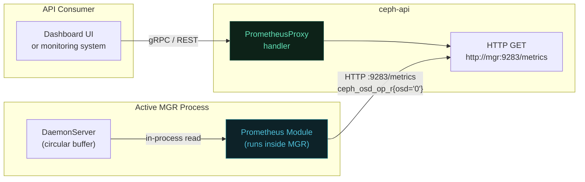
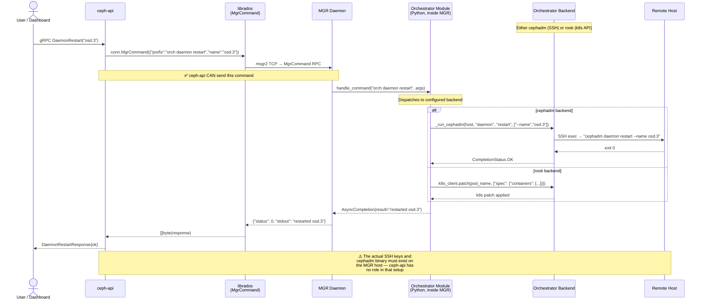
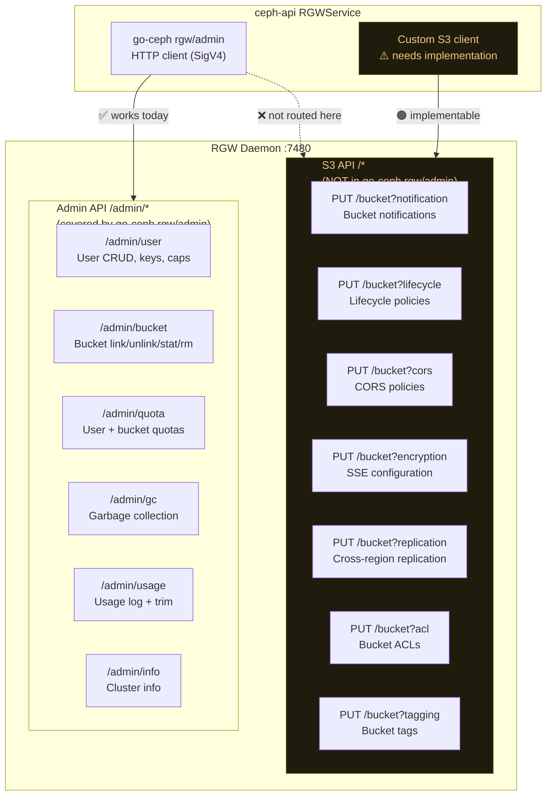
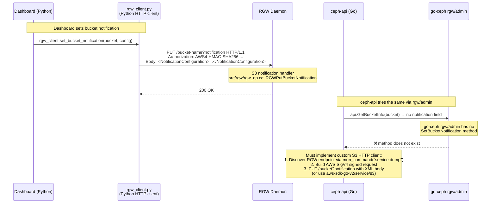
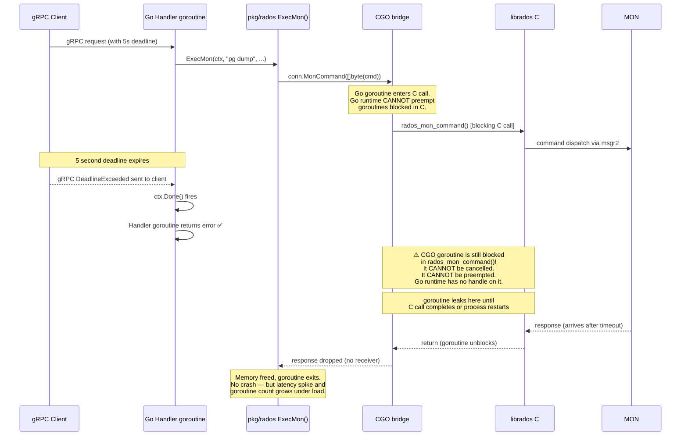
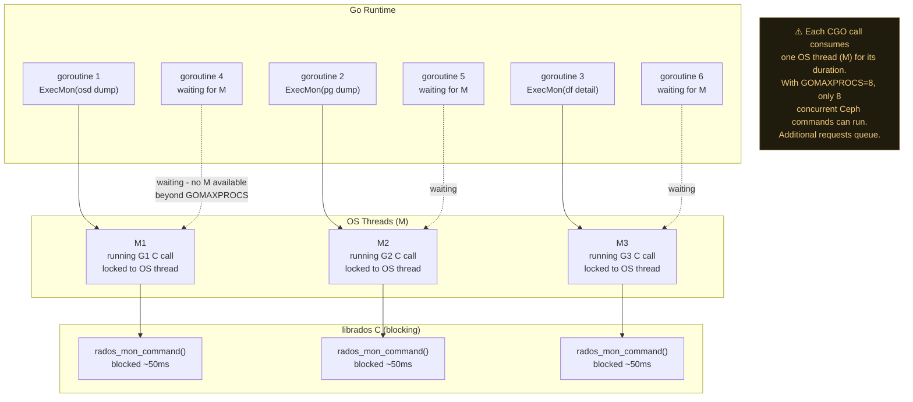
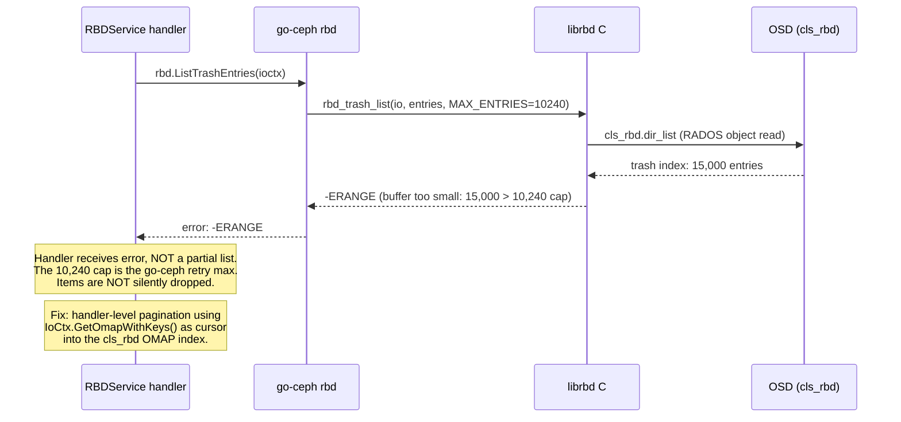
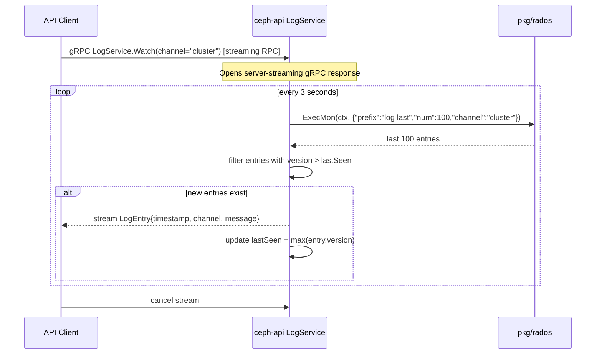
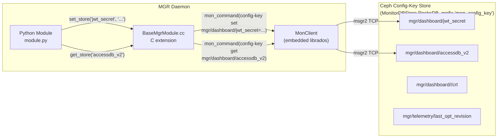

# Infeasible & Constrained Operations in ceph-api

This document provides a deep-dive into every operation that ceph-api **cannot implement** with its current architecture (go-ceph v0.26.0 + librados), explaining the internal Ceph mechanisms that block each one, exact message flows, and any available workarounds.

---

## Table of Contents

1. [Classification Overview](#1-classification-overview)
2. [In-process MGR Perf Counter Pipeline (Hard Block)](#2-in-process-mgr-perf-counter-pipeline)
3. [Orchestrator-Dependent Operations (Conditional)](#3-orchestrator-dependent-operations)
4. [RGW S3 Protocol Operations (Soft Block)](#4-rgw-s3-protocol-operations)
5. [CGO / go-ceph Runtime Constraints (Architectural)](#5-cgo--go-ceph-runtime-constraints)
6. [Real-time Event Log Streaming (Soft Block)](#6-real-time-event-log-streaming)
7. [MGR Module Private KV Store (Partial Access)](#7-mgr-module-private-kv-store)
8. [Workaround Summary](#8-workaround-summary)

---

## 1. Classification Overview

Operations are classified into five blocking categories:

| Symbol | Category | Meaning |
|--------|----------|---------|
| 🔴 | **Hard Block** | Technically impossible without changing ceph/mgr source |
| 🟡 | **Conditional** | Works via mgr_command IF the prerequisite is configured in the cluster |
| 🟠 | **Soft Block** | Implementable in Go but requires new code not in go-ceph |
| 🟤 | **Architectural** | Works functionally but has runtime safety constraints from CGO |
| 🟣 | **Partial Access** | Accessible via undocumented/internal API paths |

### Master Classification Table

| Operation | Dashboard endpoint | Block type | Workaround |
|-----------|-------------------|------------|------------|
| Per-OSD I/O rate (ops/sec, kB/s) | `GET /api/osd` stats | 🔴 Hard Block | Prometheus `:9283/metrics` |
| Per-MDS perf counters | `GET /api/mds` | 🔴 Hard Block | Prometheus `:9283/metrics` |
| Per-MON perf counters | `GET /api/monitor` | 🔴 Hard Block | Prometheus `:9283/metrics` |
| Per-RGW perf counters | `GET /api/rgw/daemon` | 🔴 Hard Block | Prometheus `:9283/metrics` |
| Pool I/O rate time-series | `GET /api/pool` | 🔴 Hard Block | Prometheus `:9283/metrics` |
| Daemon restart/start/stop | `POST /api/daemon/{id}/action` | 🟡 Conditional | `mgr_command("orch daemon restart")` if Orchestrator configured |
| Host add/remove | `POST /api/host` | 🟡 Conditional | `mgr_command("orch host add/rm")` if Orchestrator configured |
| OSD deployment/removal | `POST /api/osd` | 🟡 Conditional | `mgr_command("orch apply osd")` if Orchestrator configured |
| Hardware health (SMART) | `GET /api/host/{hostname}/devices` | 🟡 Conditional | `mgr_command("device ls-by-host")` + device health module |
| Cluster rolling upgrade | `POST /api/upgrade` | 🟡 Conditional | `mgr_command("orch upgrade start")` if Orchestrator configured |
| OSD `safe_to_delete` (Orch level) | `GET /api/osd/safe_to_delete` | 🟡 Conditional | `mon_command("osd safe-to-destroy")` covers Ceph-level check |
| Bucket notifications | `GET/PUT /api/rgw/bucket` notifications | 🟠 Soft Block | Custom S3 HTTP client to RGW |
| S3 lifecycle policies | `GET/PUT /api/rgw/bucket` lifecycle | 🟠 Soft Block | Custom S3 HTTP client to RGW |
| S3 CORS/SSE/replication | `GET/PUT /api/rgw/bucket` | 🟠 Soft Block | Custom S3 HTTP client to RGW |
| Context cancellation of in-flight ops | Internal | 🟤 Architectural | `rados_osd_op_timeout` for OSD ops; `rados_mon_op_timeout` does NOT bound `mon_command` |
| Goroutine preemption in CGO | Internal | 🟤 Architectural | Semaphore + WaitGroup bounding |
| RBD trash list > 10,240 items | `GET /api/block/image/trash` | 🟤 Architectural | Cursor-based pagination in handler |
| Short-lived RADOS conn leak | Internal | 🟤 Architectural | Long-lived singleton connection |
| `ceph -w` style live log | `GET /api/logs/audit` streaming | 🟠 Soft Block | Poll `log last` (filter by Paxos version); or direct CGO `rados_monitor_log2` for true push |
| MGR module private KV (`get_store`) | Module settings | 🟣 Partial | `config-key get mgr/<module>/<key>` (undocumented) |

---

## 2. In-process MGR Perf Counter Pipeline

### What It Is

The Ceph Dashboard's `GET /api/perf_counters`, OSD I/O rate graphs, and MDS/MON/RGW performance views all consume data from a **perf counter circular buffer** maintained exclusively inside the active MGR process.

### How It Works Internally

Every Ceph daemon (OSD, MDS, MON, RGW) sends periodic `MMgrReport` messages directly to the active MGR via msgr2 TCP. The MGR's `DaemonServer` C++ class receives these messages and calls Python callbacks via the C extension (`BaseMgrModule`). The in-memory rolling window (20 data points) is never serialized to any external protocol.



### The Exact Barrier

The data lives in `src/mgr/DaemonState.h`:

```cpp
// src/mgr/DaemonState.h (simplified)
struct PerfCounterInstance {
  PerfCounterType type;
  std::vector<PerfCounterData> data;  // circular buffer, 20 entries
};

class DaemonState {
  std::map<std::string, PerfCounterInstance> perf_counters;
  // ...no serialization to any command response format
};
```

The Python binding at `src/mgr/BaseMgrModule.cc`:

```cpp
PyObject *BaseMgrModule::get_unlabeled_counter_latest(
    const std::string &daemon_name, const std::string &counter_name) {
  // Directly reads DaemonState::perf_counters in-process
  // Returns a Python list — no msgr2 serialization happens
}
```

There is no `mon_command` or `mgr_command` that serializes this rolling-window data. The only command that touches perf counters is `osd perf`, which returns a **current snapshot** of commit and apply latency (in milliseconds, from `PGMap::dump_osd_perf_stats()`), not the time-windowed rates that the dashboard computes by diffing consecutive circular buffer entries. Source: `src/mon/PGMap.cc:2101` — dumps `os_commit_latency_ns / 1000000ull` and `os_apply_latency_ns / 1000000ull`.

### External Access Paths

While no `mon_command`/`mgr_command` serializes the circular buffer data, there are multiple external paths. For ceph-api the most practical is the Prometheus module:

1. **Prometheus MGR module** — `http://<mgr>:9283/metrics` (in-process, reads DaemonState directly)
2. **Dashboard REST API** — `GET /api/perf_counters/{svc_type}/{id}` (in-process, via `get_unlabeled_counter_latest()`)
3. **influx/telegraf MGR modules** — push perf counters to InfluxDB/Telegraf (in-process)
4. **`ceph-exporter` daemon** — `http://<host>:9926/metrics` — a standalone C++ daemon that reads each daemon's admin socket via `counter dump`, bypassing the MGR entirely

Note: `osd perf` (`PGMap::dump_osd_perf_stats()`) travels via `MPGStats` from OSDs to MONs — it is a completely different pipeline from `MMgrReport`. It returns a windowed latency average `(sum_new - sum_old) / (count_new - count_old)`, not a monotonic counter and not the MGR circular buffer.

### The Prometheus Workaround

The MGR's built-in Prometheus module (`ceph mgr module enable prometheus`) exposes all `MMgrReport` data as labeled metrics at `http://<mgr-host>:9283/metrics`. The Prometheus module runs **inside the same MGR process** and has access to the same `DaemonState` memory. ceph-api can proxy or query this endpoint:



Add a `PrometheusProxy` RPC that: (1) reads the Prometheus endpoint URL from `mon_command("mgr dump")["services"]["prometheus"]`, (2) proxies the `/metrics` response, (3) optionally re-labels/aggregates specific metric families.

---

## 3. Orchestrator-Dependent Operations

### What It Is

Operations that modify cluster topology — adding/removing hosts, deploying or restarting daemons, rolling upgrades, and hardware SMART queries — go through the **Orchestrator module** running inside the MGR Python layer.

### How It Works Internally



### The Conditional Barrier

ceph-api CAN send all Orchestrator `mgr_commands`. The **conditional** part:

1. The cluster must have the `orchestrator` MGR module enabled and configured
2. The active backend (cephadm or rook) must be bootstrapped
3. For cephadm: SSH keys must be on the MGR host; cephadm must be installed on target hosts
4. For rook: k8s credentials and CRD access must be configured in the MGR pod

ceph-api has no control over any of these — they are cluster deployment concerns, not API concerns.

### What ceph-api Can Do Without an Orchestrator Backend

**All `orch *` commands require an Orchestrator backend** (`cephadm` or `rook`). Without one, every `orch` command — including read-only queries like `orch host ls` — raises `NoOrchestrator` with return code `-ENOENT` and the message `"No orchestrator configured (try \`ceph orch set backend\`)"`. Source: `src/pybind/mgr/orchestrator/_interface.py:1899,81` — `_oremote()` raises unconditionally when `_select_orchestrator()` returns `None`.

The following commands are **not `orch` commands** and work without any Orchestrator backend — they are core MGR or `devicehealth` module commands:

| mgr_command | Returns | Source |
|-------------|---------|--------|
| `{"prefix":"device ls","format":"json"}` | All known devices with health | `DaemonServer.cc` |
| `{"prefix":"device ls-by-host","hostname":"X"}` | Devices on specific host | `MgrCommands.h:209` |
| `{"prefix":"device get-health-metrics","devid":"X"}` | SMART health data | `devicehealth` module |
| `{"prefix":"osd safe-to-destroy","ids":["0"]}` | Whether OSD can be safely removed | `DaemonServer.cc:2073` |

The correct command for listing deployed daemons when an Orchestrator **is** configured is `orch ps` (not `orch daemon ls`, which does not exist).

---

## 4. RGW S3 Protocol Operations

### What It Is

RGW exposes **two completely separate API surfaces** on the same port:

1. **S3 API** (`/`) — implements the AWS S3 REST protocol for object operations AND bucket configuration (lifecycle, CORS, notifications, SSE, replication)
2. **Admin API** (`/admin/`) — RGW-specific management API for users, quotas, buckets (link/unlink/stat), GC, LC, usage logs

go-ceph's `rgw/admin` package wraps **only the Admin API**. Several important dashboard features use the S3 API's bucket configuration endpoints.

### The Two API Surfaces



### Sequence: What Happens for a Bucket Notification PUT



### Implementation Path (Soft Block)

These operations can be implemented using `aws-sdk-go-v2/service/s3` pointed at the RGW endpoint:

```go
// Endpoint discovery
svcDump, _ := svc.ExecMon(ctx, `{"prefix":"service dump","format":"json"}`)
rgwEndpoint := parseRGWEndpoint(svcDump) // e.g. "http://192.168.1.10:7480"

// Configure AWS SDK with RGW endpoint
cfg, _ := config.LoadDefaultConfig(ctx,
    config.WithCredentialsProvider(credentials.NewStaticCredentialsProvider(
        accessKey, secretKey, "",
    )),
    config.WithEndpointResolverWithOptions(
        aws.EndpointResolverWithOptionsFunc(func(service, region string, options ...interface{}) (aws.Endpoint, error) {
            return aws.Endpoint{URL: rgwEndpoint, HostnameImmutable: true}, nil
        }),
    ),
)
s3Client := s3.NewFromConfig(cfg)

// Now bucket notifications, lifecycle, CORS, SSE, replication all work
s3Client.PutBucketNotificationConfiguration(ctx, &s3.PutBucketNotificationConfigurationInput{...})
```

Add `github.com/aws/aws-sdk-go-v2/service/s3` as a dependency.

---

## 5. CGO / go-ceph Runtime Constraints

These are **not blockers on functionality** but impose runtime safety constraints that must be handled correctly. Ignoring them causes goroutine leaks, unbounded memory growth, or silent data corruption.

### 5a. Context Cancellation Does Not Cancel In-flight Ceph Ops



**Current mitigation in ceph-api:** `production_conn.go` sets `rados_osd_op_timeout` and `rados_mon_op_timeout` in the connection config so the C-level timeout fires and unblocks the C call eventually. This limits the goroutine leak duration to the configured timeout window.

**Recommended pattern:**

```go
func (s *Svc) ExecMonBounded(ctx context.Context, cmd string) ([]byte, error) {
    type result struct { data []byte; err error }
    ch := make(chan result, 1)
    go func() {
        // This goroutine may leak if CGO blocks, but it is bounded by rados_mon_op_timeout
        data, err := s.ExecMon(context.Background(), cmd)
        ch <- result{data, err}
    }()
    select {
    case res := <-ch:
        return res.data, res.err
    case <-ctx.Done():
        // Client context cancelled/timed out.
        // Background goroutine continues until C-level timeout fires.
        return nil, ctx.Err()
    }
}
```

### 5b. Goroutine Blocking Under Load



**Mitigation:** Use a semaphore to bound concurrent Ceph operations:

```go
type Svc struct {
    conn    RadosConnInterface
    limiter chan struct{} // e.g., make(chan struct{}, 16)
}

func (s *Svc) ExecMon(ctx context.Context, cmd string) ([]byte, error) {
    select {
    case s.limiter <- struct{}{}:
        defer func() { <-s.limiter }()
    case <-ctx.Done():
        return nil, ctx.Err()
    }
    // ... proceed with MonCommand
}
```

### 5c. RBD Trash List Pagination Gap

The go-ceph `rbd.ListTrashEntries(ioctx)` function internally calls `rbd_trash_list()` which is capped at **10,240 items** by the go-ceph retry allocator (`retry.WithSizes(32, 10240, ...)`). When there are more than 10,240 trash items, `rbd_trash_list` returns `-ERANGE` and go-ceph propagates it as an error — items are **NOT silently dropped; the entire call returns an error** (source: go-ceph `rbd/rbd.go`, retry.go #779).



**Mitigation:** Implement pagination at the handler level using the entry `id` field as a cursor:

```go
func listAllTrash(ioctx *rados.IOContext) ([]rbd.TrashImageInfo, error) {
    var all []rbd.TrashImageInfo
    for {
        batch, err := rbd.ListTrashEntries(ioctx) // max 10,240
        if err != nil { return nil, err }
        all = append(all, batch...)
        if len(batch) < 10240 { break } // no more pages
        // advance by removing the first 10,240 from the index
        // (implementation requires direct cls_rbd OMAP pagination)
    }
    return all, nil
}
```

Note: true cursor-based pagination requires calling the underlying `cls_rbd` OMAP directly via `IoCtx.GetOmapWithKeys()`, as go-ceph does not expose the offset parameter of `rbd_trash_list`.

### 5d. Memory Leak with Short-lived RADOS Connections

Creating and destroying `rados.Conn` objects rapidly causes RSS to grow toward the high-water mark of peak connection state. This is not an unbounded leak — each destroyed connection frees its resources — but glibc's ptmalloc2 allocator retains freed heap pages as RSS rather than returning them to the OS immediately, so RSS climbs with each cycle up to the peak allocation. Calling `malloc_trim(0)` or using a single long-lived connection avoids this.

**The pattern ceph-api already uses correctly:** a single long-lived `rados.Conn` created at startup (`pkg/rados/production_conn.go`), shared across all requests. Never create per-request connections.

---

## 6. Real-time Event Log Streaming

### What It Is

The `ceph -w` command displays new cluster log entries as they arrive. The dashboard's `GET /api/logs/audit` with long-polling semantics provides similar functionality. Both rely on getting log entries pushed as they are generated.

### How `ceph -w` Actually Works

`ceph -w` uses a genuine **push subscription**, not polling. Source: `src/ceph.in:1123–1157`.

```python
# src/ceph.in (simplified)
run_in_thread(cluster_handle.monitor_log2, level, watch_cb, 0)
signal.pause()  # blocks; watch_cb fires on each new entry
```

The call chain:
1. `monitor_log2()` in `src/pybind/rados/rados.pyx:1305` → `rados_monitor_log2()` C API
2. `src/librados/RadosClient.cc:976` → `monclient.sub_want("log-info", 0, 0)` + `renew_subs()` — sends `MMonSubscribe` to the Monitor
3. `src/mon/LogMonitor.cc:1077` (`check_subs`) — Monitor pushes new `MLog` messages to all subscribers when entries are committed
4. `RadosClient::handle_log()` at line 1031 — invokes callback and advances the subscription watermark via `sub_got()`

There is **no polling loop and no 200ms interval**. The `rados_monitor_log` / `rados_monitor_log2` C API is a documented, public push interface (`src/include/rados/librados.h:4087`). The Mon's `LogMonitor` handles subscriptions for `"log-debug"`, `"log-info"`, `"log-warn"`, `"log-error"` via the same `MMonSubscribeAck` mechanism used for OSDMap and MDSMap subscriptions. Log entries are stored in the Monitor's internal **RocksDB** (MonitorDBStore prefix `"logm"`) — they have nothing to do with RADOS objects or the config-key store.

De-duplication is by **Paxos version watermark** (`sub_got()` advances `s->next`), not by timestamp or message hash. The Monitor only sends entries with version > the client's last acknowledged version.

### Why Push Is Unavailable in ceph-api Today

The librados C API `rados_monitor_log2` IS a real push mechanism. The barrier for ceph-api is that **go-ceph v0.26.0 does not wrap `rados_monitor_log`** — there is no `MonitorLog` function in the go-ceph rados package (confirmed in `github.com/ceph/go-ceph@v0.32.0/rados/`).

Two paths to true push in ceph-api:
1. **Direct CGO call** — call `rados_monitor_log2` directly from Go via `import "C"`, bypassing go-ceph. The callback fires in a C thread; it must post to a Go channel via `CGO_EXPORT`.
2. **MGR plugin webhook** — a small Python MGR module registers via `NotificationQueue` and HTTP-POSTs each `clog` entry to ceph-api.

### Polling Workaround (for now)

Until CGO push is implemented, polling every 3–5 seconds via `log last` is adequate for dashboard-style log views:



The `log last` Mon command supports `num`, `level` (`debug|info|sec|warn|error`), and `channel` (`cluster|audit|cephadm`) parameters (source: `src/mon/MonCommands.h:227–232`).

---

## 7. MGR Module Private KV Store

### What It Is

MGR Python modules can store and retrieve private data using:

```python
self.set_store("my_setting", "my_value")
value = self.get_store("my_setting")
```

This is used by the dashboard for things like: Grafana URL, JWT secret seed, MOTD, audit log settings, and other per-module configuration that doesn't fit the `config set` namespace.

### How It Works Internally



### The Undocumented Access Path

The config-key store is accessible externally via `mon_command`:

```json
{"prefix": "config-key get", "key": "mgr/dashboard/jwt_secret"}
{"prefix": "config-key set", "key": "mgr/dashboard/jwt_secret", "val": "..."}
{"prefix": "config-key ls"}
```

**Important:** `config-key` access requires `mon 'allow *'` (admin) or an explicit `config-key` capability grant. A client with only `mon 'allow r'` or `mon 'allow rw'` cannot access config-key — the Mon's `MonCap` explicitly exempts the `config-key` service from blanket caps (source: `src/mon/MonCap.cc:427`). Only the `"profile mgr"` capability or `allow *` grants implicit config-key access.

**The limitation is:**
1. The key names are **module-specific and undocumented** — no public schema exists
2. They can change between Ceph versions
3. Writing to another module's KV store is unusual and could break that module
4. Note: `jwt_token_ttl` and `GRAFANA_API_URL` are **module options** (accessed via `get_module_option()`/`set_module_option()`, stored in the ceph config subsystem), not `set_store()` keys — they are NOT in the config-key store

### Practical Guidance

For ceph-api, this matters only for reading/writing settings that the dashboard or other modules store privately. For operational features (not dashboard compatibility), ceph-api uses `config set/get` for all its own settings — which is the documented, stable API.

If a specific module store key is needed (e.g., reading the JWT secret the dashboard set), the access path is:

```go
jwtSecret, err := svc.ExecMon(ctx, `{"prefix":"config-key get","key":"mgr/dashboard/jwt_secret","format":"plain"}`)
```

Note: Grafana URL, JWT TTL, and similar per-module settings are **module options** stored via `get_module_option()`/`set_module_option()`, not in config-key. Access those via `{"prefix":"config get","who":"mgr","key":"mgr/dashboard/<option_name>"}` or `{"prefix":"config set","who":"mgr.module.dashboard","name":"<option_name>","value":"..."}`.

---

## 8. Workaround Summary

| Infeasible operation | Workaround |
|---------------------|------------|
| Per-OSD/MDS/MON perf counter time-series | Proxy Prometheus at `http://<mgr>:9283/metrics`; discover URL via `mon_command("mgr dump")["services"]["prometheus"]` |
| Orchestrator daemon/host lifecycle | `mgr_command("orch daemon restart/add/rm")` — works IF Orchestrator configured; return descriptive error if not |
| RGW bucket notifications | `aws-sdk-go-v2/service/s3` + RGW endpoint discovery via `service dump` |
| RGW lifecycle/CORS/SSE/replication | Same AWS SDK approach |
| Context cancellation of CGO ops | Wrapper goroutine + `select` on `ctx.Done()` to abandon result; set `rados_osd_op_timeout` for OSD-level C-side timeout. Note: `rados_mon_op_timeout` does NOT bound `rados_mon_command` — `ctx.wait()` in `RadosClient::mon_command` has no timeout (source: `src/librados/RadosClient.cc`) |
| RBD trash list > 10,240 (returns `-ERANGE`, not silent drop) | Handler-level pagination via `IoCtx.GetOmapWithKeys()` as cursor into `cls_rbd` OMAP |
| Real-time log streaming | Near-term: gRPC server-streaming RPC wrapping `log last` poll (3–5s, filter by Paxos version); long-term: direct CGO call to `rados_monitor_log2` for true push |
| MGR module private KV (specific known keys) | `mon_command("config-key get/set key=mgr/<module>/<keyname>")` |
